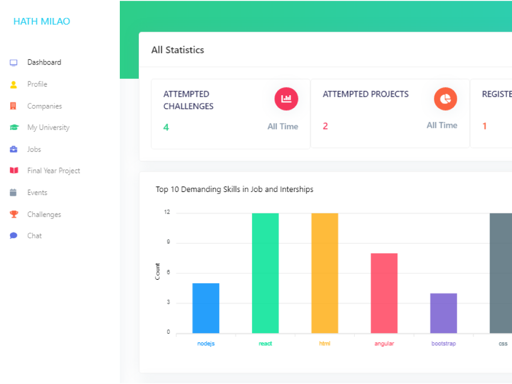
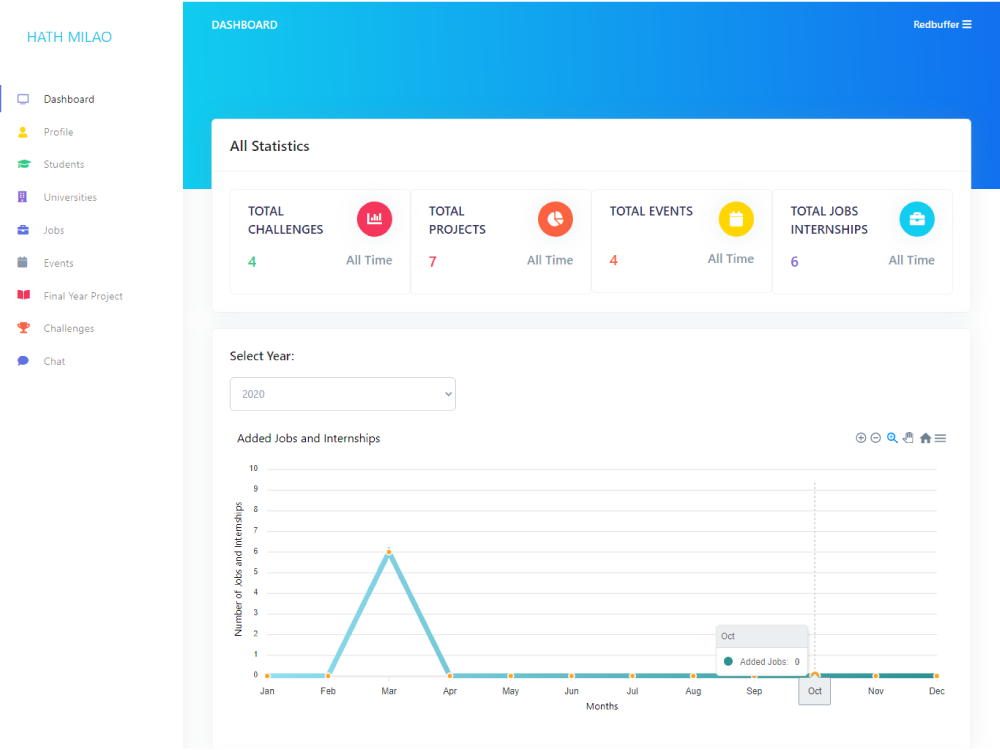
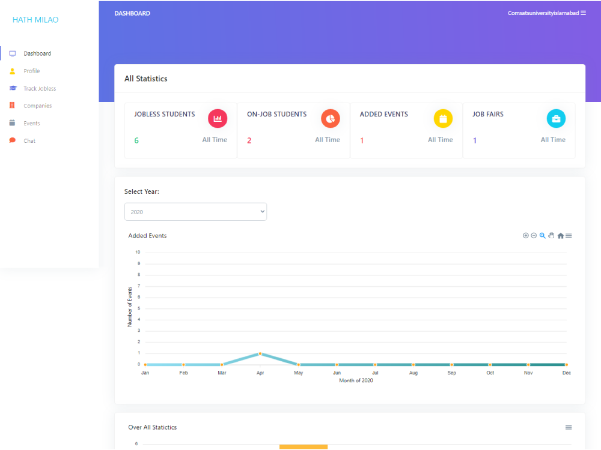

# Introduction
Our proposed system is a job and internship portal which is a place where students, industrial
companies and universities can interact with each other. Students can find jobs and internships easily,
apply for a particular job, internship and attempt weekly challenges. Companies can post ad for jobs
and internships, give weekly tasks. Companies will short list the final year projects for students.
Career centers also ensures that every student of their university gets the job. They can easily track
which student is jobless. Universities and companies will be able to manage job fairs. Companies can
create any event, workshop and webinar. Universities will be able to create any on-campus events.
Students can view and attend the events. Career center will be able to view the profile of student if in
case of any mistake they can contact with student and alumni to help them to avoid these kinds of
mistakes. Companies will also see the profile of students and alumni. Student and alumni will see the
recommended jobs and internships in their home page. Companies will also see the recommended
candidate in their home page. Students, alumni, companies and career center have a dashboard in
which they will be able to see the statistics of different thing.

# Screenshots

## Author

- **Qaiser Ali Khan** - [Github](https://github.com/qaiseralikhan) - [LinkedIn](https://www.linkedin.com/in/qaiseralikhan/)
